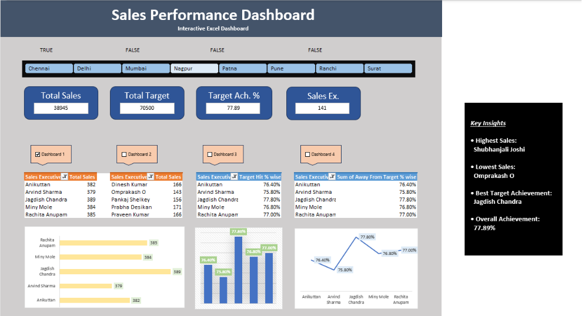

# 📊 Sales Performance Dashboard (Excel)

## Project Overview
This project is an interactive Sales Performance Dashboard built in Microsoft Excel to analyze sales executive performance using Pivot Tables, Pivot Charts, Slicers, and KPI Cards.

## Tools Used
- Microsoft Excel
- Pivot Tables
- Pivot Charts
- Slicers
- KPI Cards
- Conditional Formatting

## Dashboard Features
- Total Sales
- Total Target
- Target Achievement %
- Sales Executives
- Top Performing Sales Executives
- Lowest Performing Sales Executives
- Interactive City Filter
- Business Insights

## Key Insights
- Highest Sales Executive: Shubhanjali Joshi
- Lowest Sales Executive: Omprakash O
- Best Target Achievement: Jagdish Chandra
- Overall Target Achievement: 77.89%

## Skills Demonstrated
- Data Cleaning
- Data Analysis
- Dashboard Design
- Business Reporting
- KPI Analysis

## Dashboard Preview

